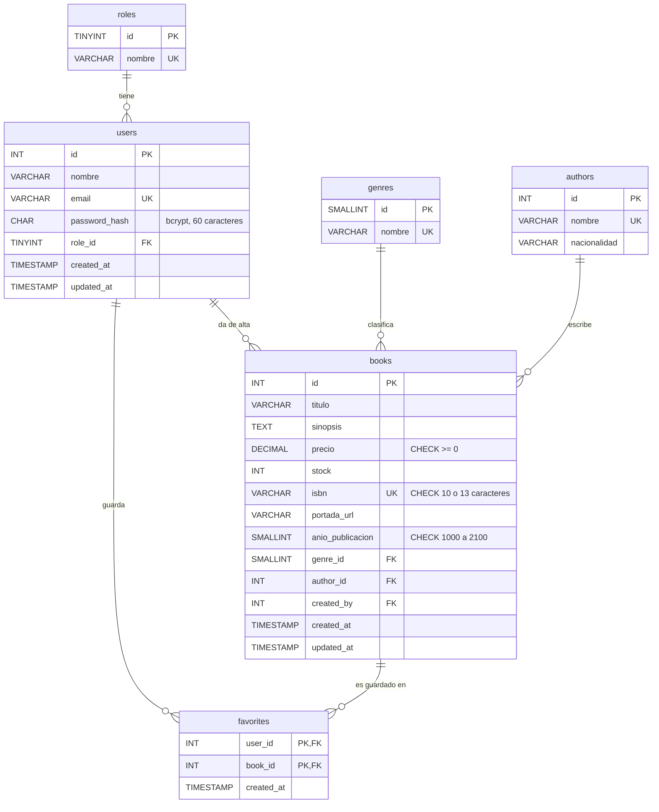

# Diagrama entidad-relación

Base de datos `turing_libreria` (MySQL 8), diseñada en tercera forma normal (3NF). GitHub dibuja este diagrama automáticamente a partir del bloque Mermaid.

## Reglas de integridad

| Relación | Al borrar el registro padre |
|---|---|
| `roles` → `users` | `RESTRICT`: no se puede borrar un rol con usuarios. |
| `genres` → `books` | `RESTRICT`: no se puede borrar un género con libros. |
| `authors` → `books` | `RESTRICT`: no se puede borrar un autor con libros. |
| `users` → `books.created_by` | `SET NULL`: el libro se conserva aunque se borre el admin que lo creó. |
| `users` → `favorites` | `CASCADE`: se borran los favoritos del usuario. |
| `books` → `favorites` | `CASCADE`: el libro desaparece de los favoritos. |

## Por qué está en 3NF

- **1NF:** cada columna guarda un solo valor; no hay listas dentro de un campo.
- **2NF:** en `favorites`, la única tabla con llave compuesta, `created_at` depende de la llave completa (usuario + libro).
- **3NF:** los libros no repiten el nombre del autor ni del género; solo guardan su id. Así, cambiar el nombre de un autor se hace en un solo lugar.

## Objetos adicionales

- **Vista `v_libros`:** une `books` con `genres` y `authors`, y calcula `disponible` (`stock > 0`). La API lee el catálogo desde aquí.
- **Trigger `trg_books_antes_de_agregar`:** si un libro se da de alta sin portada, la arma con su ISBN usando Open Library.
